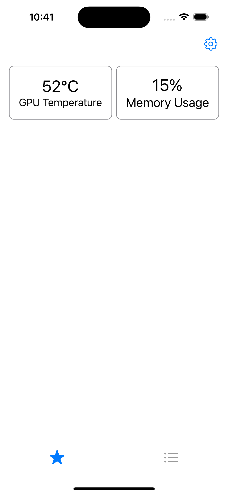
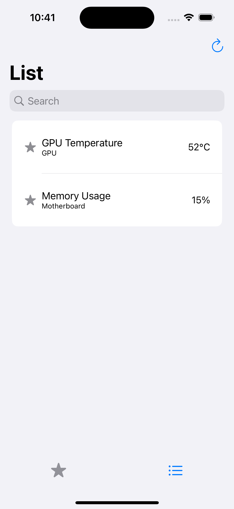
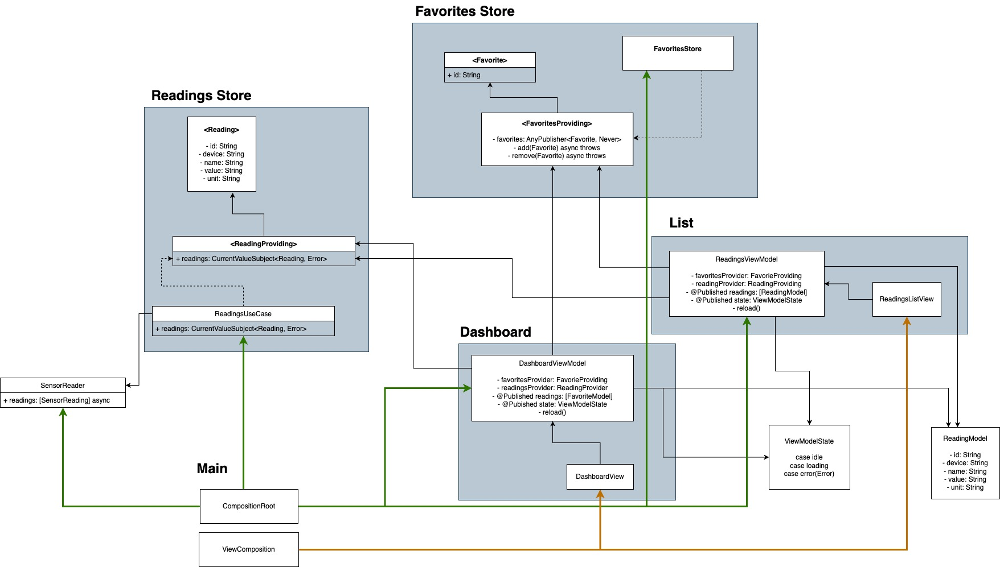

# SensorReader

Sensor reader is a companion app to [Remote Sensor Monitor](https://www.hwinfo.com/forum/threads/introducing-remote-sensor-monitor-a-restful-web-server.1025/), which itself is a companion to [HWInfo](https://www.hwinfo.com).

SensorReader pulls measurements from Remote Sensor Monitor. It then displays them as a list, allowing you to favorite individual items. Disclaimer: I definitely have no design skills. 🙈

## The why

While playing games on my PC, I want to track various stats, like temperature and CPU usage.
I decided to write my own iOS client since there were none available for HWInfo. As it evolved, the project turned into a playground to study app architecture. It then split into two separate projects, SensorReader and ComposableSensorReader.

This is the SensorReader. To see ComposableSensorReader, click [here](https://www.github.com/tadelv/ComposableSensorReader).

## Composition

I decided to see what Composition Root is all about. The Composition Root glues individual components together, allowing for greater separation of concerns. It allows the components to focus on doing one thing only, but with increased flexibility. Individual components specify their outward facing dependencies, and the Composition Root binds them. With this approach, the boundaries between components are clear and flexibility increases.

Of course I did not follow this to a T. There are still some places, where dependencies could be eliminated further and structure could be improved. 

## Structure

Let's take a look at app. We begin at the main app file, which calls upon the Composition Root object, to build the view hierarchy.
Composition Root is where all the components are created and glued together. It gives us a dedicated space where we connect components with their dependencies. From here we can see a few objects and their dependencies instantiated. Objects like UseCases, Stores and a ViewModel for the settings. Right now, the settings only care about the URL of the server, but we need the ViewModel to do something else also. It shows the settings UI whenever the app is not configured, i.e. there is no server URL in the storage. Upon setting the URL, the ViewModel calls a function, which creates a new Reader objects and assigns it to the UseCase. This function lives in the Composition Root, so SettingsViewModel has no knowledge of the Reader object.
ReadingsUseCase counts the number of it's subscribers. If it rises above 0, it will start a timer and fetch readings from the server at a specified time interval. Subscribers such as ReadingsViewModel or DashboardViewModel then attach to its publisher to receive updates. The UseCase only cares about the readings provider (a specific protocol), but does not hold a reference to any ViewModel.
ReadingsView model has a task of mapping the readings into a list while also exposing an interface to set a particular reading as a favorite. DashboardViewModel gathers favorite readings in a list.
Their respective views attach to their publishers and display the results.

Below is a rough outline of the architecture.

